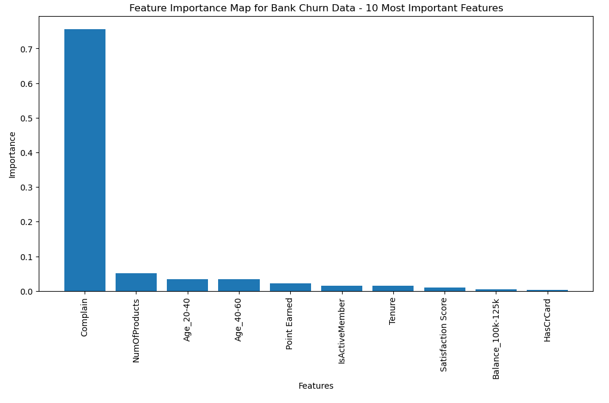

# Customer Churn Analysis

Data source:
https://www.kaggle.com/datasets/radheshyamkollipara/bank-customer-churn?resource=download

## Introduction: Brief about the project

The purpose of this project is to determine the intended key factors that cause customer churn from bank institutions. Churn prevention will allow banks to develop loyalty programs and retain campaigns to keep as many customers as possible. Various factors was taken into account to find various factors that may cause customer churn in the banking industry. These include poor customer service, high fees, low interest rates, and even the age of the customer. Other factors may include credit score, estimated salary and whether a customer is an active member or not. 

Predicting customer churn involves analysing diverse customer data -transactions, demographics, activity, and interactions providing insights to uncovering predictive analytics through the use of machine learning. Different machine learning models have been developed throughout this project to unveil the patterns of hidden layers. Learning models such as Extreme Gradient Boosting model (XGBoost), Keras Tuner model, and Support Vector Classifier (SVC). Using these machine learning models, a predictive analysis can be made on what features are the most important and selecting the right hyperparameter for optimising deep learning models built with TensorFlow.

The data analysis comes into fruition when the primary goal is to determine an accurate machine-learning model that can predict churn based on the given factors. After strategies for customer retention can be made into the banking industry.

In summary, our project intends to determine the key drivers that cause customer churn from bank institutions (Churn referring to customers leaving a given bank for a competitor service).
Analysis goal:
1. How do factors such as tenure (number of years customer has been with bank), customer bank account balance, salary, credit score etc affect churn rate?
2. How can we predict churn rate based on these factors?

## About Dataset
RowNumber—corresponds to the record (row) number and has no effect on the output.

CustomerId—contains random values and has no effect on customer leaving the bank.

Surname—the surname of a customer has no impact on their decision to leave the bank.

CreditScore—can have an effect on customer churn, since a customer with a higher credit score is less likely to leave the bank.

Geography—a customer’s location can affect their decision to leave the bank.

Gender—it’s interesting to explore whether gender plays a role in a customer leaving the bank.

Age—this is certainly relevant, since older customers are less likely to leave their bank than younger ones.

Tenure—refers to the number of years that the customer has been a client of the bank. Normally, older clients are more loyal and less likely to leave a bank.

Balance—also a very good indicator of customer churn, as people with a higher balance in their accounts are less likely to leave the bank compared to those with lower balances.

NumOfProducts—refers to the number of products that a customer has purchased through the bank.

HasCrCard—denotes whether or not a customer has a credit card. This column is also relevant, since people with a credit card are less likely to leave the bank.

IsActiveMember—active customers are less likely to leave the bank.

EstimatedSalary—as with balance, people with lower salaries are more likely to leave the bank compared to those with higher salaries.

Exited—whether or not the customer left the bank.

Complain—customer has complaint or not.

Satisfaction Score—Score provided by the customer for their complaint resolution.

Card Type—type of card hold by the customer.

Points Earned—the points earned by the customer for using credit card.

Acknowledgements:

As we know, it is much more expensive to sign in a new client than keeping an existing one.

It is advantageous for banks to know what leads a client towards the decision to leave the company. Churn prevention allows companies to develop loyalty programs and retention campaigns to keep as many customers as possible.

## Objective: What the project aims to achieve

This project aims to achieve an accurate machine learning predictive model that can determine the churn of the customer and find the potential predictor feature that is suitable for the banking industry. Stated in the introduction, the primary objective of this project is to identify the main factors that cause customers to leave the bank for another competitor's service. These factors include tenure (number of years the customer has been with the bank), credit score, estimated salary, balance and age. Ultimately, the insights from this project could be used to help banks develop more efficient methods to keep customer retention from other banks and prevent customers from churning out. 

## Methods: Details about the methods and techniques used

The CSV data from kaggle was converted to 'data.db' for storage using SQLite in the 'CSVtoSQL.ipynb' script. Each analysis script first loads the db file in before converting it to a pandas DataFrame for analysis.

Preparing the data was a simple task of determining which data would be used for the predictive analysis and which data would be removed and deemed unnecessary for the analysis. The data was fairly clean for this specific dataset, with very little data cleaning and handling missing values. Although there was very little data cleaning, encoding categorical data into numerical and finding the values of each column and finding the unique values were needed to get an accurate rating for each model. The most important columns that were consistently used throughout the project were the tenure, credit score, estimated salary, satisfaction score, and age. Each column was converted to numerical data, using dummies and bins to categorize the newly formatted numerical data. 

As for the models that were used throughout the project, TensorFlow, XGBoost, SVC, and Keras Tuner were all used and optimised to provide an accurate predictive model. Choosing a model for this project was a convoluted task that required critical thinking and analytical reasoning. Each model is tailored for a specific scenario to find an accurate predictive analysis. Tensor Flow is a deep learning framework that specializes in building and training neural networks. The XGBoost is a gradient-boosting framework, where the algorithm model primarily focuses on decision trees. XGBoost uses an ensemble of weak decision trees to create a powerful predictive model.

For Keras Tuner, the library of optimal sets of hyperparameters assisted in selecting the right hyperparameter for machine learning (Tensor Flow program). The hyperparameter remain the same throughout the machine learning training process and directly impacts the performance the predictive model. 

SVC is the supervised learning algorithm that can be used for both classification and regression tasks. For this project, SVC was primarily used for its flexibility and accuracy parameters that can be used to give an accurate predictive model. As for the kernel functions, the most common Radial Basis Function (RBF) kernel. 

In summary, the multiple machine learning models have different purposes for predicting the model accurately. Tensor Flow is mainly used to develop a deep learning framework that specialising in building and training neural networks. XGBoost is a boosting gradient that primarily focuses on decision trees from assembling weak decision trees. Keras Tuner helps optimise the machine learning programs. SVC was used for its flexibility and kernel tricks which allows high-accuracy predictive models. 

## Analysis

### Data Preprocessing (for all models)
- Establishes a connection to a SQLite database named "data.db" and reads the "data" table into a pandas dataframe named "churn_data".
- Non-essential columns like "RowNumber", "CustomerId", "Surname", and "Geography" are dropped from the dataframe.
- Credit score, estimated salary, balance, and age are binned into categories to improve model performance.
- Categorical data is converted to numerical using one-hot encoding with pd.get_dummies.
- The data is then split into features (X) and target variable (y) representing churn (Exited).
- Training and testing datasets are created using train_test_split.
- A StandardScaler instance is used to normalize the training data, and the scaler is then applied to both training and testing sets.

### TensorFlow

### Keras Tuner
Keras Tuner is a hyperparameter tuning library for TensorFlow. This package automates tuning for our neural network model in an attempt to search for the best set of parameters for the machine learning model.

### Model Building and Tuning with KerasTuner
- A function create_model is defined to build a sequential neural network model with hyperparameter options.
- KerasTuner is used to search for the best combination of hyperparameters including:
    * Activation function (relu, tanh, sigmoid)
    * Number of neurons in the first hidden layer
    * Number of hidden layers (1 to 5)
    * Number of neurons in each hidden layer
- A RandomSearch tuner is used with 10 trials and the validation accuracy is tracked during the search process.
- A custom callback AccuracyLogger is implemented to record validation accuracy after each epoch.

### Results and Analysis
- The code successfully trains and tunes the model.
- The best model achieves a validation accuracy of 99.8799%

- The top 3 model hyperparameter configurations and their corresponding accuracies are displayed.
- The top 3 models are evaluated on the testing data, and all achieve similar accuracy around 0.9988.
- The best model's hyperparameters are identified.
- Finally, the best model is evaluated again on the full testing data, achieving a loss of 0.3142 and an accuracy of 99.88%
 
### Support Vector Classifer
SVC attempts to model a hyperplane that separates the classes (in this case binary classes) in feature space with the largest margin (distance between the hyperplane and the closest data point). It is commonly used for binary classification tasks and is well suited for this project.
They are also resistant to overfitting via its support vectors which may assist in this scenario.
This model produced an accuracy of 99.72%

### XGBoost (Gradient Boosting Model)
XGBoost (Extreme Gradient Boosting) is a type of boosting algorithm, these are machine learning models that combine multiple weak learning models such as decision trees into a sequential system. Each weak learning model corrects errors made be the previous one.
This makes XGBoost effective at binary classification and is well suited for this project.
XGBoost is also capable of determining feature importance which provided an opportunity to verify the feature importance results conducted alongside our initial neural network.
This model produced an accuracy of 99.90%.

#### Feature Importance
- A Random Forest Classifier (rf) is created and fit to the training data (X, y).
- The feature importances are retrieved from the rf model using rf.feature_importances_.
- A pandas dataframe named "feature_importance_df" is created to store feature names and importances.
- The dataframe is sorted by feature importance in descending order and the top 10 most important features are selected for visualization.
- A bar chart is created to visualize the importance of the top 10 features for customer churn prediction.
- The top 10 most important features for customer churn prediction are:

## Findings

#### 1.How do factors such as tenure (number of years customer has been with bank), customer bank account balance, salary, credit score etc affect churn rate?

Our analysis concluded that the most important factor in determining likelihood of customer churn by a large margin was whether the customer had put in a complaint to the bank. The second most impactful factor was consistently the number of products a customer had with the bank, albeit to a much lesser extent as compared to the complaint factor.

#### 2.How can we predict churn rate based on these factors?

Predicting churn accurately was done very accurately with a variety of machine learning models. The Gradient Boosting Machine model proved to be the best performing at 99.90% accurate. Using Keras Tuner to optimise a neural network was second best, with the most accurate model being 99.88% accurate. The Support Vector Machine model was third at 99.72% accurate.
