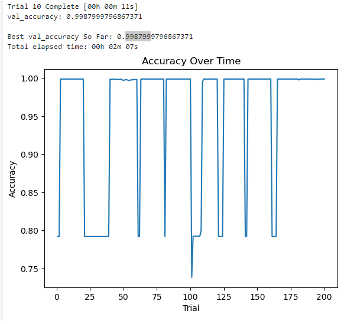

# Customer Churn Analysis
test

Data source:
https://www.kaggle.com/datasets/radheshyamkollipara/bank-customer-churn?resource=download

## Project Description
Our project intends to determine the key drivers that cause customer churn from bank institutions (Churn referring to customers leaving a given bank for a competitor service).
Analysis goal:
1. How do factors such as tenure (number of years customer has been with bank), customer bank account balance, salary, credit score etc affect churn rate?
2. How can we predict churn rate based on these factors?

## About Dataset
RowNumber—corresponds to the record (row) number and has no effect on the output.
CustomerId—contains random values and has no effect on customer leaving the bank.
Surname—the surname of a customer has no impact on their decision to leave the bank.
CreditScore—can have an effect on customer churn, since a customer with a higher credit score is less likely to leave the bank.
Geography—a customer’s location can affect their decision to leave the bank.
Gender—it’s interesting to explore whether gender plays a role in a customer leaving the bank.
Age—this is certainly relevant, since older customers are less likely to leave their bank than younger ones.
Tenure—refers to the number of years that the customer has been a client of the bank. Normally, older clients are more loyal and less likely to leave a bank.
Balance—also a very good indicator of customer churn, as people with a higher balance in their accounts are less likely to leave the bank compared to those with lower balances.
NumOfProducts—refers to the number of products that a customer has purchased through the bank.
HasCrCard—denotes whether or not a customer has a credit card. This column is also relevant, since people with a credit card are less likely to leave the bank.
IsActiveMember—active customers are less likely to leave the bank.
EstimatedSalary—as with balance, people with lower salaries are more likely to leave the bank compared to those with higher salaries.
Exited—whether or not the customer left the bank.
Complain—customer has complaint or not.
Satisfaction Score—Score provided by the customer for their complaint resolution.
Card Type—type of card hold by the customer.
Points Earned—the points earned by the customer for using credit card.

Acknowledgements
As we know, it is much more expensive to sign in a new client than keeping an existing one.
It is advantageous for banks to know what leads a client towards the decision to leave the company. Churn prevention allows companies to develop loyalty programs and retention campaigns to keep as many customers as possible.

## Methodology

### Report 1 - Analysis with Hyperparameter Tuning
This report analyzes a Python code that builds and tunes a machine learning model to predict customer churn. The code utilizes KerasTuner for hyperparameter optimization and achieves a high accuracy rate.

### Data Preprocessing
- The code imports necessary libraries including pandas, scikit-learn, TensorFlow, and KerasTuner.
- It establishes a connection to a SQLite database named "data.db" and reads the "data" table into a pandas dataframe named "churn_data".
- Non-essential columns like "RowNumber", "CustomerId", "Surname", and "Geography" are dropped from the dataframe.
- Credit score, estimated salary, balance, and age are binned into categories to improve model performance.
- Categorical data is converted to numerical using one-hot encoding with pd.get_dummies.
- The data is then split into features (X) and target variable (y) representing churn (Exited).
- Training and testing datasets are created using train_test_split.
- A StandardScaler instance is used to normalize the training data, and the scaler is then applied to both training and testing sets.

### Model Building and Tuning with KerasTuner
- A function create_model is defined to build a sequential neural network model with hyperparameter options.
- KerasTuner is used to search for the best combination of hyperparameters including:
    * Activation function (relu, tanh, sigmoid)
    * Number of neurons in the first hidden layer
    * Number of hidden layers (1 to 5)
    * Number of neurons in each hidden layer
- A RandomSearch tuner is used with 10 trials and the validation accuracy is tracked during the search process.
- A custom callback AccuracyLogger is implemented to record validation accuracy after each epoch.

### Results and Analysis
- The code successfully trains and tunes the model.
- The best model achieves a validation accuracy of 99.8799%

- The top 3 model hyperparameter configurations and their corresponding accuracies are displayed.
- The top 3 models are evaluated on the testing data, and all achieve similar accuracy around 0.9988.
- The best model's hyperparameters are identified.
- Finally, the best model is evaluated again on the full testing data, achieving a loss of 0.3142 and an accuracy of 99.88%
 

#### Report 2 - Analysis of Customer Churn Prediction with Feature Importance
The Python code utilises a Random Forest Classifier to determine the most important features for churn prediction

#### Data Preprocessing
- The code imports necessary libraries including pandas, scikit-learn, TensorFlow, and Matplotlib.
- It establishes a connection to a SQLite database named "data.db" and reads the "data" table into a pandas dataframe named "churn_data".
- Non-essential columns like "RowNumber", "CustomerId", "Surname", and "Geography" are dropped from the dataframe.
- Credit score, estimated salary, balance, and age are binned into categories.
- Categorical data is converted to numerical using one-hot encoding with pd.get_dummies.
- The data is then split into features (X) and target variable (y) representing churn (Exited).
- Training and testing datasets are created using train_test_split.
- A StandardScaler instance is used to normalize the training data, and the scaler is then applied to both training and testing sets.

#### Model Building and Feature Importance
- A Random Forest Classifier (rf) is created and fit to the training data (X, y).
- The feature importances are retrieved from the rf model using rf.feature_importances_.
- A pandas dataframe named "feature_importance_df" is created to store feature names and importances.
- The dataframe is sorted by feature importance in descending order and the top 10 most important features are selected for visualization.
- A bar chart is created to visualize the importance of the top 10 features for customer churn prediction.

#### Results and Analysis
- The Random Forest Classifier achieves an accuracy of 99.64% on the testing data.
- The bar chart, titled "Feature Importance Map for Bank Churn Data - 10 Most Important Features", shows the relative importance of each feature for predicting customer churn.
- The top 10 most important features for customer churn prediction are:

#### Report 2 Conclusion
The code successfully implements a Random Forest Classifier to identify the most important features for predicting customer churn. The results suggest that customers who complain, have a higher number of products, and are younger are more likely to churn. Additionally, factors like customer satisfaction and account activity are important for churn prediction.

[Images/important_feature_for_bank_churn_data.png]: Images/important_features_for_bank_churn_data.png
[Images/best_accuracy_99_879_percent.png]: Images/best_accuracy_99_879_percent.png